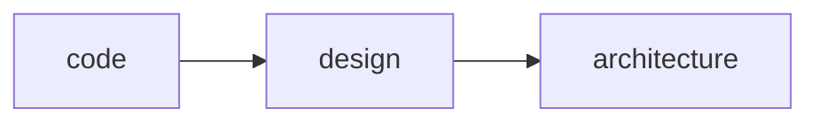

<h1 align="center">Clean Code and Clean Architecture</h1>

<h2>Clean Code</h2>

- Testabilidade;
- Resiliência;
- Estrutura que mantém o comportamento de pé.

<h2>Refactoring</h2>

- Torna-lo mais fácil de ser entendido e menos custoso de ser modificado. Sem alterar o seu comportamento observável;
- Reactoring é um investimento;
- Confiança para refatorar o código;
- Refatorar com um propósito;
- Reconhecer e lidar no dia a dia com os code smells (sintomas), tomando ações necesárias para tratar.

<h2>Code Smells</h2>

| Tipo | Exemplos |
| ------------- | ------------- |
| Nome estranhos  | Renomear função, Renomear variável e Renomear arquivo |
| Linhas em branco  | Apagar linha em branco |
| Comentários | Introduzir variável explicativa e Introduzir uma função explicativa |
| Código morto  | Apagar código |
| Condição confusas, Aninhadas, Complexas e Extensas  | Consolidar condicionais, Extrair condição, Introduzir cláusula guarda e Introduzir ternário |
| Números mágicos  | Extrair constantes |
| Tratamento inadequado de erros  | Tratar erros de forma adequada e Introduzir tratamento de exception |
| Classe ou arquivo grande  | Extrair classe |
| Inveja de dados / Longa cadeia de dados  | Extrair um método e Mover um método para outra classe |

<h2>Design Patterns</h2>

<h3>POO</h3>

- Proteção da invariância;
- Disciplina de transferência indireta de controle;
- Classe é para criar classificações;
- Polimorfismo e flexibilizar o comportamento;
- Distribuição de complexidade em vários componentes diferentes de forma que um use outro.

<h3>Strategy</h3>

- Delegar a responsabilidade ou comportamento adquirida pela entidade;
- Padrao de comportamento;
- Varia o algoritmo conforme o runtime.

<h3>Factory</h3>

- Uma fabrica de instancias que tem como característica um comportamento;
- Padrão de criação.

<h3>Chain of Responsability</h3>

- Chain é cadeia, rede e sequencia;
- Responsability é a responsabilidade e comportamento;
- Quer ou não quer tratar o elo.

<h2>Test-Driven Development</h2>

> Design e a arquitetura não favorecem a automação dos testes quando se tem dependências indiretas durante um teste de um método. Também, pode ser uma API externa que tem seu valor alterado a cada instante.

- TDD (Test-Driven Development) é um método para construir software, não para testa-lo.

<h3>Three Laws of TDD</h3>

- Você não pode escrever nenhum código até ter escrito um teste que detecte uma possível falha;
- Você não pode escrever mais testes de unidade do que suficiente para detectar a falha;
- Você não pode escrever mais código do que o suficiente para passar nos testes.

**Modelo de construção de teste:**

- *Given/Arrange*: Definição de todas as informações necessárias para executar o comportamento que será testado;
- *When/Act*: Executar o comportamento;
- *Then/Assert*: Verificar o que aconteceu após a execução, comparando as informações retornadas com a expectativa que foi criada.

<h2>Tipos de teste automatizado</h2>

<h3>Unit Tests</h3>

- São testes de baixo nível, o mais próximo da aplicação (método, classe e etc).

<h3>Integration Test</h3>

- Junção de camadas diferentes dentro da aplicação.

<h3>E2E Test</h3>

- Replica o comportamento do usuário usando o sistema na sua forma mais pura.

<h2>FIRST</h2>

- *Fast*: Os testes devem rodar rápido;
- *Independent*: Não deve existir dependência entre os testes, eles devem poder ser executados de forma isolada;
- *Repeatable*: O resultado deve ser o mesmo independente da quantidade de vezes que seja executado;
- *Self-validating*: O próprio teste deve ter uma saída bem definida do que é validado ou não fazendo com que ele passe ou falhe;
- *Timely*: Os testes devem ser escritos antes do código-fonte.

<h2>Port and Adapters</h2>

<h3>Driver (guia aplicação)</h3>

- Quando alguém quer interagir com a aplicação. Sem que aplicação saíba qualquer detalhe sobre a forma de acesso.

<h3>Driven (aplicação guia)</h3>

- Quando a aplicação quer interagir com alguém, ela também utiliza um adaptador especifico para cada tipo de tecnologia. Sem que aplicação saíba qualquer detalhe sobre a forma de acesso.

<h3>Portas</h3>

- A analogia com uma porta é exatamente a mesma que temos *quando pensamos em conectar qualquer tipo de dispositivo em uma computador*, existe um contrato com um protocolo definido onde qualquer fornecedor pode adaptar sua tecnologia para interagir com a porta;
- São contratos (interface) que o driver e driven interagem.

<h2>Test Patterns (Stub, Spy, Mock, and Fake)</h2>

<h3>Test Double (Mock)</h3>

- É um padrao que tem o objetivo de substituir um doc (depended-on component) em um determinado tipo de teste por motivos de performance ou segurança.

<h3>Dummy</h3>

- Parâmetros que não são explicitamente usado pelo comportamento testado;
- Objetos que criamos apenas para completar a lista de parâmetros que precisamos passar para invocar um determinado método.

<h3>Stubs</h3>

- Objetos que retornam respostas prontas, definidas para um determinado teste, por questão de performance ou segurança (exemplo: quando eu executar o método faze pedido, preciso que o método pegue a cotação do dólar e retorne R$3,00);
- O que eu uso para substituir um determinado componente que forma uma dependência indireta.

<h3>Spy</h3>

- Analisa se algo foi chamado e com qual parâmetro foi chamado;
- Objetos que "espionam" a execução do método e armazenam os resultados para verificação posterior (exemplo: quando eu executar o método fazer pedido, preciso saber se o método enviar e-mail foi invocado internamente e com quais parâmetros).

<h3>Mock</h3>

- Seta expectativa no mock object e verifica se aconteceu;
- O mock mistura stub e o spy;
- Objetos similares a stubs e spy permitem que você diga extamente o que quer que faça e o teste vai quebrar se isso não acontecer.

<h3>Fake</h3>

- Ter uma implementação para retornar algo específico;
- Fake é uma implementação que simula algo original;
- Objetos que tem implementação que simulam o funcionamento da instância real que seria utilizada em produção (exemplo: uma base de dados em memória).