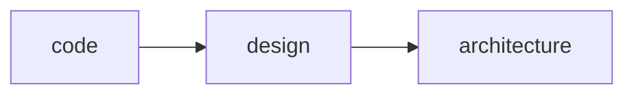

<h1 align="center">Clean Code and Clean Architecture</h1>

<h2>Clean Code</h2>

**Testabilidade**

**Resiliência**

**Estrutura que mantém o comportamento de pé**

<h2>Refactoring</h2>

- Torna-lo mais fácil de ser entendido e menos custoso de ser modificado. Sem alterar o seu comportamento observável.
- Refactoring é um investimento.
- Confiança para refatorar o código.
- Refatorar com um propósito.
- Reconhecer e lidar no dia a dia com os code smells (sintomas), tomando ações necessárias para tratar.

<h2>Code Smells</h2>

| Tipo | Exemplos |
| ------------- | ------------- |
| Nome estranhos  | Renomear função, Renomear variável e Renomear arquivo |
| Linhas em branco  | Apagar linha em branco |
| Comentários | Introduzir variável explicativa e Introduzir uma função explicativa |
| Código morto  | Apagar código |
| Condição confusas, Aninhadas, Complexas e Extensas  | Consolidar condicionais, Extrair condição, Introduzir cláusula guarda e Introduzir ternário |
| Números mágicos  | Extrair constantes |
| Tratamento inadequado de erros  | Tratar erros de forma adequada e Introduzir tratamento de exception |
| Classe ou arquivo grande  | Extrair classe |
| Inveja de dados / Longa cadeia de dados  | Extrair um método e mover um método para outra classe |

<h2>Design Patterns</h2>



<h3>POO</h3>

- Proteção da invariância.
- Disciplina de transferência indireta de controle.
- Classe é para criar classificações.
- Polimorfismo e flexibilizar o comportamento.
- Distribuição de complexidade em vários componentes diferentes de forma que um use outro.

<h3>Strategy</h3>

- Delegar a responsabilidade ou comportamento adquirida pela entidade.
- Padrão de comportamento.
- Varia o algoritmo conforme o runtime.

<h3>Factory</h3>

- Uma fabrica de instancias que tem como característica um comportamento.
- Padrão de criação.

<h3>Chain of Responsability</h3>

- Chain é cadeia, rede e sequencia.
- Responsability é a responsabilidade e comportamento.
- Quer ou não quer tratar o elo.

<h2>Test-Driven Development</h2>

> Design e a arquitetura não favorecem a automação dos testes quando se tem dependências indiretas durante um teste de um método. Também, pode ser uma API externa que tem seu valor alterado a cada instante.

- TDD (Test-Driven Development) é um método para construir software, não para testa-lo.

<h3>Three Laws of TDD</h3>

- Você não pode escrever nenhum código até ter escrito um teste que detecte uma possível falha.
- Você não pode escrever mais testes de unidade do que suficiente para detectar a falha.
- Você não pode escrever mais código do que o suficiente para passar nos testes.

**Modelo de construção de teste:**

- *Given/Arrange*: Definição de todas as informações necessárias para executar o comportamento que será testado.
- *When/Act*: Executar o comportamento.
- *Then/Assert*: Verificar o que aconteceu após a execução, comparando as informações retornadas com a expectativa que foi criada.

<h2>Tipos de teste automatizado</h2>

<h3>Unit Tests</h3>

- São testes de baixo nível, o mais próximo da aplicação (método, classe e etc).

<h3>Integration Test</h3>

- Junção de camadas diferentes dentro da aplicação.

<h3>E2E Test</h3>

- Replica o comportamento do usuário usando o sistema na sua forma mais pura.

<h2>FIRST</h2>

- *Fast:* Os testes devem rodar rápido.
- *Independent:* Não deve existir dependência entre os testes, eles devem poder ser executados de forma isolada.
- *Repeatable:* O resultado deve ser o mesmo independente da quantidade de vezes que seja executado.
- *Self-validating:* O próprio teste deve ter uma saída bem definida do que é validado ou não fazendo com que ele passe ou falhe.
- *Timely:* Os testes devem ser escritos antes do código-fonte.

<h2>Port and Adapters</h2>

<h3>Driver (guia aplicação)</h3>

- Quando alguém quer interagir com a aplicação. Sem que aplicação saíba qualquer detalhe sobre a forma de acesso.

<h3>Driven (aplicação guia)</h3>

- Quando a aplicação quer interagir com alguém, ela também utiliza um adaptador especifico para cada tipo de tecnologia. Sem que aplicação saíba qualquer detalhe sobre a forma de acesso.

<h3>Portas</h3>

- A analogia com uma porta é exatamente a mesma que temos *quando pensamos em conectar qualquer tipo de dispositivo em uma computador*, existe um contrato com um protocolo definido onde qualquer fornecedor pode adaptar sua tecnologia para interagir com a porta.
- São contratos (interface) que o driver e driven interagem.

<h2>Test Patterns (Stub, Spy, Mock, and Fake)</h2>

<h3>Test Double (Mock)</h3>

- É um padrao que tem o objetivo de substituir um doc (depended-on component) em um determinado tipo de teste por motivos de performance ou segurança.

<h3>Dummy</h3>

- Parâmetros que não são explicitamente usado pelo comportamento testado.
- Objetos que criamos apenas para completar a lista de parâmetros que precisamos passar para invocar um determinado método.

<h3>Stubs</h3>

- Objetos que retornam respostas prontas, definidas para um determinado teste, por questão de performance ou segurança (exemplo: quando eu executar o método faze pedido, preciso que o método pegue a cotação do dólar e retorne R$3,00).
- O que eu uso para substituir um determinado componente que forma uma dependência indireta.

<h3>Spy</h3>

- Analisa se algo foi chamado e com qual parâmetro foi chamado.
- Objetos que "espionam" a execução do método e armazenam os resultados para verificação posterior (exemplo: quando eu executar o método fazer pedido, preciso saber se o método enviar e-mail foi invocado internamente e com quais parâmetros).

<h3>Mock</h3>

- Seta expectativa no mock object e verifica se aconteceu.
- O mock mistura stub e o spy.
- Objetos similares a stubs e spy permitem que você diga extamente o que quer que faça e o teste vai quebrar se isso não acontecer.

<h3>Fake</h3>

- Ter uma implementação para retornar algo específico.
- Fake é uma implementação que simula algo original.
- Objetos que tem implementação que simulam o funcionamento da instância real que seria utilizada em produção (exemplo: uma base de dados em memória).

<h2>Clean Architecture - Part 1</h2>

<p>"Beginners may sometime only use entity object as data carriers and place all dynamic behaviour in control (service). This should, however be avoided. Instead, quite lot of behaviour should be placed in the entity objects."</p>

<h3>O que é design ?</h3>

<p>É a interação entre vários blocos.</p>

<h3>Qual é a diferença entre design e arquitetura ?</h3>

<p>Design é a interação entre blocos que ocorre de forma externa e arquitetura é a sustentação para que tudo alcance o resultado necessário em cada contexto.</p>

- Design é interação
- Arquitetura é sustentação

<h3>Entities (Enterprise Business Rules)</h3>

- Contém as regras de negócio independentes, regras que se aplicam a qualquer situação.

<h3>Use Cases (Application Business Rules)</h3>

- Contém as regras de negócio da aplicação que são oferecidas a um driver.
- Tem a responsabilidade de se comunicar com Controllers, Presenters, Gateways e Repositories.
- Quem guia a aplicação conversa com o caso de uso e o caso de uso conversa com os recursos que são necesários para executar a regra de negócio e a camada de domínio.
- Coisas que posso fazer na aplicação.
- Ele é sensível ao contexto e quem está do lado de fora da aplicação.
- Test Integration.

<h3>Controllers, Presenters and Gateways (Interface Adapter)</h3>

- Uma ponte entre uma tecnologia especifica, por exemplo: protocolo http e a aplicação. Isso 

<h3>Devices, DB, Web, External Interfaces and UI (Frameworks & Driver)</h3>

- Tem que existir uma separação entre controller e a instaciação da aplicação.
- Implementação do framework, da conexão com a biblioteca e da tecnologia.
- Uma ponte entre uma biblioteca específica com uma interface específica.
- Ter um framework específico disponível através de uma interface (contrato).

<h3>O que é um adapter ?</h3>

<p>É um padrão de projeto que faz uma conversão de uma interface em outra. É um conceito de adaptação.</p>

<h3>O que Clean Architecture faz no main ?</h3>

- Instancia os diferentes strategies ou factories que são relevantes para aplicação.
- Entrepoint da aplicação.

<h2>Clean Architecture - Part 2</h2>

<p>"The center of your application is the use cases of your aplication."</p>

**Importante:**
- Uma camada é uma fronteira lógica entre um conjunto de componentes que tem uma responsabilidade bem definida.
- As camadas não tem necessariamente relação física com organização de pasta.
- Repository conhece categoricamente a entidade.
- Entidade é para resolver regra de negócio e use case expõem a regra.

<h3>Entities</h3>

- Entidades são responsáveis por modelar as regras de negócio independentes e que podem ser aplicadas em qualquer contexto.
- Ela não se mistura com **obtenção de dados**.
- Uma entidade é um conjunto de regras de negócio independentes que pode ser um objeto com métodos ou até mesmo um conjunto de funções.
- São considerados componentes de alto nível (high level) de abstração e por serem estáveis mudam com menos frequência que outras camadas, podendo ser reusados com facilidade.
- Conseguir criar regras independentes e reusáveis que possa entrar na composição de regras de aplicação (Application Business Rules).

<h3>O que significam regras de negócio independentes ?</h3>

<p>São cenários que validam informação a partir do que é recebido independente de terceiros.</p>

<h3>O problema do domínio anêmico</h3>

<p>Regras de negócio que seguem de forma concentrada e de forma procedural.</p>

<h3>Use Case</h3>

<p>Um caso de uso é basicamente uma técnica para capturar, modelar e especificar requisitos. Foi apresentada por Ivan Jacobson em 1987</p>

- O caso de uso indica ações e necessidades do usuário final.
- No Clean Architecture os casos de uso contém regras de negócio especificas que resolvem problemas aplicando as regras de negócio independentes em um contexto, por exemplo: fazer um pedido, cancelar um pedido, simular o frete, validar um cupom de desconto, realizar um pagamento e emitir uma nota fiscal.
- Eles realizam a oquestração das entidades, executando regras de negócio independentes.
- Testes de use case são no nível de integração.
- Caso de uso é diferente de **CRUD**.

<h3>Como um caso de uso deve fazer para acessar o banco de dados ?</h3>

- *Repository:* Um Repository é uma abstração para uma coleção de agregados (cluster de objeto de domínio), normalmente associado ao DDD (Domain-Driven Design).
- *DAO:* Um DAO, ou Data Access Object, é um padrão de estrutura que separa a camada de domínio da persistência, oferecendo uma interface para acessar dados de forma polimórfica.
- *Gateway:* Um Gateway é um objeto que encapsula o acesso a um sistema externo ou recurso.
- *Active & Record:* No Active e Record um registro em uma tabela do banco de dados é encapsulado em um objeto, juntando conceitos de domínio e persistência.
- *Data Mapper:* Um Data Mapper é exatamente o que os ORM's fazem, movam dados de um objeto para o banco de dados e vice-versa.

**Qual padrão deve ser utilizado ?**

- Tanto faz, o caso de uso deve conhecer apenas a interface.

<h3>Controllers, Presenters and Gateways</h3>

- A ponte entre o use case e a tecnologia especifica, por exemplo: API ou Database. É desenvolvida através do design pattern Adapter, por isso, essa camada se chama de Interface Adapter.
- Essa camada faz a ponte entre um dispositivo de I/O e os casos de uso.
- Tradução para tecnologia específica.
- **Todo código SQL** pertence a esta camada.
- Interação com sistema de arquivos e qualquer API externa também.

<h3>Devices, DB, Web, External Interface and UI</h3>

- Um driver é o nível mais baixo (low level) de abstração, é o comportamento que realiza a conexão com o banco de dados ou que realiza requisições HTTP.
- Essa camada geralmente configura a relação com frameworks e bibliotecas.
- Configuração de rotas da API.
- Definição da porta onde as requisições serão recebidas.
- Configurações do pool de conexões juntamnte com a URL, Port, User, Password e Database.

<h3>Dependency Rule</h3>

- Quem está fora conehce quem está dentro e quem está dentro não conhece quem esta fora.
- Direção de fora para dentro.
- Reuso e redução de fragilidade.
- Dependency Source Code.

<h3>Como inicializamos a aplicação ?</h3>

<p>O main é o ponto de entrada da aplicação (HTTP, CLI, UI e Testes), lá que as fábricas e estratégias são inicializadas e as injeções de dependência são realizadas durante a inicialização.</p>

<h2>Design Pattern - Abstract Factory</h3>

<p>Prove uma interface para criação de famílias de objetos relacionados.</p>

<h2>Diagrama de interação entre os componentes em cada camada (Entities, Use Case, Interface Adapter e Framework & Drivers)</h2>

- UML (Unified Modeling Language) é a forma de expressar por meio de diagramas a relação entre componentes.
- Um componente conhece a interface e outro implementa essa interface.

<h2>Domain-Drive Design - Part 1</h2>

<p>O objetivo do Domain-Driven Design é evitar algo conhecido como Big Ball of Mud.</p>

- Desenvolver orientado ao domínio é excelete para abstrair regras de negócio complexas, mas burocrático em CRUDs.
- O domínio é o problema que uma organização precisa resolver para entregar uma solução que realmente atenda as necessidades de negócio dos seus clientes.
- Quando se fala em domínio, ele pode ser: compra de um produto, calcular imposto, matrícula de um aluno e vender ingresso online.
- Importante olhar para o domínio como um todo.
- A **modelagem estratégica** identifica e define as fronteiras entre os bounded context.
- Você já está fazendo a modelagem estratégica ao implementar qualquer tipo de integração.
- A forma de interação entre cada bounded context é detalhada em um context map.

<h3>Ubiquitous Language</h3>

<p>A linguagem ubiqua é falada entre os especialistas no domínio e a equipe de desenvolvimento dentro de um determinado contexto delimitado, que é o local onde aquele domínio se aplica.</p>

- É uma linguagem estabelecida entre **domain expert** e **technical expert**, ela é compartilhada. Alem disso, a linguagem ubiqua deve ser refletida dentro do código-fonte, não apenas em documentos, diagramas e glossários.

<h3>Tipos de subdomínio</h3>

- Core ou Base: É o mais importante e que traz mais valor para a empresa, é onde você coloca seus maiores e melhores esforços.
- Support ou Auxiliary: Complementa o Core Domain, sem ele não é possível ter sucesso no negócio.
- Generic: É um subdomínio que pode ser delegado para outra empresa ou mesmo ser um produto de mercado.

<h3>Bounded Context</h3>

- Um bounded context é onde o problema é resolvido, está no espaço da solução, forma um limite explícito dentro do qual um modelo de domínio será implementado.
- Solução ou implementação a uma determinada área do subdomínio.

<h2>Modelagem estratégica</h2>

<p>É o particionamento do domínio como um todo em partes menores.</p>

- Nem todo bounded context precisa ser desenvolvido da mesma forma.
- A fronteira do bounded context é excelente para definir um microservice.

<h3>Shared kernel</h3>

- Determina que vários bounded context reusem um pedaço de código, por exemplo: um arquivo .jar que contém objetos de conexão ao banco de dados ou ao domínio.

<h3>Customer/Supplier</h3>

- Downstream ou Upstream, onde uma fornece para outro informações.
- Aqui existe uma relação de fornecimento, no entanto, tudo é combinado e adequado às necessidades em uma relação de Upstream e Downstream, por exemplo: integração com um ERP.

<h3>Conformist</h3>

- Uma integração com uma API externa, contratada no modelo SaaS, acaba sendo do tipo conformista, já que temos que nos adequar a sua interface, por exemplo: integração com um Gateway de pagamento.

<h3>Anti-Corruption Layer</h3>

- Traduzir um domínio externo que não tem terminologia adequada ao meu domínio. Então, temos uma série de tradutores entre as relações de domínio.
- As relações conformistas geralmente exigem uma tradução para o domínio e isso pode ser feito por meio de adaptadores (Adapter Interface) importantes para inclusive permitir a utilização de diferentes fornecedores.

<h3>Separate Ways</h3>

- São decisões de seguir por caminhos independentes e sem integração.

<h3>Quais são as vantagens e desvantagens em ter uma arquitetura de microservice ?</h3>

- **Vantagens:** Diversidade tecnológica, melhor controle sobre o débito técnico (menos código) e facilidade em acompanhar a evolução tecnológica.
- **Desvantagens:** Transação distribuídas, dificuldade em tratar e dignosticar erros e complexidade técnica mais alta.

*Você só tem escabilidade, independência e resiliência se for comunicação assincrona.*

<h3>Fazendo uma boa modelagem estratégica</h3>

**Divisão da complexidade**

**Equipes menores**

**Reuso**

<h3>Comunicação assíncrona, Event-Driven, Architecture e CQRS</h3>

**Escabilidade**

**Independência entre os serviços**

**Tolerância à falhas**

**Resiliência**

<h2>Domain-Driven Desgin - Part 2</h2>

<h3>Modelagem tática</h3>

<p>A modelagem tática é utilizada para construir o domain model.</p>

<h3>Entities</h3>

<p>Abstraem regras de negócio independentes, assim como no Clean Architecture, mas no DDD (Driven-Domain Design) elas tem identidade e estado, podendo sofrer mutação ao longo do tempo, por exemplo: pedido, item, cliente e cupon.</p>

**Como gerar a identidade ?**

- *Manualmente:* O próprio usuário pode gerar a identidade da entidade, nesse caso é mais complicado garantir unicidade.
- *Aplicação:* A aplicação pode utilizar um algoritmo para gerar a identidade como um gerador de UUID e GUID.
- *Banco de Dados:* O banco de dados pode por meio de uma sequence ou outro tipo de registro pode centralizar a geração da identidade.
- *Outro Bounded Context:* A geração pode ser delegada para outro bounded context.

**Como comparar ?**

<p>A comparação entre entities se dá normalmente pela identidade, sem levar em consideração as características do objeto.</p>

<h3>Value Object</h3>

<p>According to Martin Fowler, a Value Object is a small simple object, like money or a date range, whose equality isn't based on identity. Kacper Gunia explains further: The most important thing is that these objects reflect the language you talk to other developers - when you say Location everyone knows what it means. Second thing is that VO can validate values passed and forbid to construct such object with incorrect data. Third benefit is fact that you can rely on type - you know that if such VO was passed as an argument it will be always in valid state and you don't need to worry about that. Also VO can contain some specialised methods that only make sense in context of this value and can be attached to this object (no need to create weird Util classes).</p>

- Também contém regras de negócio independente, no entanto são identificados pelo seu valor, sendo imutáveis, ou seja, a sua mudança implica na sua substituição, por exemplo: código do pedido, cpf e dimensão.
- Uma técnica para identificar um Value Object é tentar substituí-lo por um tipo primitivo como uma string ou um número.
- A diferença entre Value Object e Entities, é a questão de ter uma identidade e mudar o estado com o passar do tempo.

**Um Value Object é restrito a uma Entity ou pode ser utilizado em vários lugares ?**

<p>O Value Object transita mais que a Entity.</p>

<h3>Domain Service</h3>

<p>Realiza tarefas específicas do domínio, não tendo estado. É indicado quando a operação que você quer executar não pertence a uma Entity ou a um Value Object, por exemplo: calculadora de frete, calculadora de distância e calculadora de estoque.</p>

- Domain service é exclusivo (independente) para regras de negócio, diferente de Use Case que é a aplicação (orquestração) de recursos ou regra de negócio.
- Utilize em operação que envolvem múltiplos objetos de domínio.
- Normalmente quando uma operação afeta múltiplos objetos de domínio, não pertencendo a nenhum deles, ela deve ser descrita em um Domain Service.
- Cuidado para não criar serviços procedurais, favorecendo um modelo **anêmico**.

**Como definir o relacionamento entre diferentes Entities e Value Objects ?**

<p>O relacionamento entre diferentes Entities e Value Objects é estabelecido por um Aggregate. A relação entre os objetos de domínio não é a mesma utilizada no banco de dados. O problema dessa abordagem é grandes Aggregates e desperdício de memória, além de sobrecarregar o banco de dados sem necessidade já que nem sempre a camada de aplicação estará interessada em utilizá-lo na íntegra. O desafio é balancear a preservação da invariância com o consumo de recursos.</p>

<h3>Aggregates</h3>

<P>Um Aggregate é um agrupamento, ou cluster, de objetos de domínio como Entities e Value Objects, estabelecendo o relacionamento entre eles, tratando como uma unidade.</p>

- Todo Aggregate tem uma raiz, que é uma **entity** por meio do qual as operações sobre o Aggregate são realizadas.

*IMPORTANTE: Quando você está retaurando o estado de um determinado objeto de domínio (Aggregate), as regras foram impostas na persistência do dado.*

**Boas práticas na criação de Aggregates**

- *Crie aggregates pequenos:* Comece sempre com apenas uma entidade e cresça de acordo com as necessidades.
- *Referencie outros aggregates por identidade:* Mantenha apenas a referência para outros aggregates, isso reduz a quantidade de memória e o esforço que o repository faz para recuperá-los.

**Como descobrir o limite de Aggregate ?**

<p>Se tiver difícil de implementar o repositório, talvez o Aggregate seja muito grande e possa ser melhor modelado.</p>

**Um Aggregate deve refletir a base de dados ?**

<p>Isso faria o Aggregate ser muito grande e perder sentido, tornando o Repository mais complexo do que deveria.</p>

**Um Aggregate pode referencia outros Aggregates ?**

<p>Pode, mas por identidade.</p>

**Um Aggregate pode ter apenas uma entidade ?**

<p>Pode e quanto menor melhor.</p>

**Uma entidade que faz parte de um Aggregate pode fazer parte de outro ?**

<p>Não faz muito sentido, talvez afete o SRP (Single Responsability Principle) e não faça tanto sentido lógico já que frente a uma mudança poderia quebrar um dos Aggregates que faz parte.</p>

<h3>Repositories</h3>

<p>É uma extensão do domínio responsável por realizer a persistência dos Aggregates, separando o domínio da infraestrutura.</p>

**Qual é a diferença do padrão Repository no Domain-Driven Design e o Dao ?**

<p>Um Repository lida com Aggregates, de forma integral, enquanto um DAO (Data Access Object) não tem uma granularidade definida.</p>

**Somente parte do Aggregate mudou, posso persistir apenas essa parte ?**

<p>A persistência é sempre realizada sobre o Aggregate inteiro, no entanto o Repository pode decidir quais registros do banco de dados devem ser afetados para atualização.</p>

**O Aggregate é muito grande, posso obter apenas parte do Aggregates ?**

<p>Isso significa que provavelmente o Aggregate é grande demais, para resolver será necessário quebrar o Aggregate em Aggregates menores.</p>

**Posso utilizar Lazy Loading dentro do Aggregate ?**

<p>A preservação da invariância depende da integridade do Aggregtate, se parte dele não estiver populado pode perder o sentido.</p>

**É possível utilizar diferentes filtros para obter um Aggregate ?**

<p>Com certeza, na obtenção do Aggregate diversos filtros podem ser utilizados.</p>

**Posso gerar dados para a emissão de um relatório a partir de um Repository ?**

<p>A granualidade de um relatório é diferente de utilizada pelo Aggregate e renderizar relatórios a partir de Repositories pode ser excessivamente complexo, prefira a utilização de CQRS com a criação de consultas separadas.</p>

<h3>Application Service</h3>

- É API do Bounded Context, expondo operação de negócio relevante para os clientes da aplicação, muito similar ao Use Case do Clean Architecture.
- Atua como uma fachada para os clientes, que podem ser uma API Rest, GraphQL ou gRPS, uma interface gráfica, um CLI, uma fila e entre outros.
- Faz a orquestração dos objetos de domínio e interage com a infraestrutura para fins de persistência, comunicação, integração, segurança entre outros.
- Mapeia DTOs para objetos de domínio e vice-versa, eventualmente utilizando recursos como Presenters para converter a saída para o formato mais adequado.
- Não devem existir regras de negócio dentro do Application Service, apenas orquestração.
- A camada de aplicação é naturalmente procedural enquanto a camada de domínio é favorecida pelo Orientação a Objetos.

**Um Application Service pode chamar outro ?**

<p>Isso pode criar uma dependência perigosa, que quebra o SRP (Single Responsability Principle), talvez o ideal seja publicar eventos de domínio.</p>

**Somente o Application Service pode utilizar um Repository diretamente ?**

<p>Quem é responsável por orquestrar os Aggregates é o Application Service, por esse motivo o Repository deve ser injetado nele e não nos Aggregates.</p>

**Podem existir várias operações em um Application Service ?**

<p>Sim, sem problemas, utilizar uma Screaming Architecture, conforme descrito pelo Robert Martin em Clean Architecure não é uma obrigação.</p>

**Um Application Service pode persistir vários Aggregates na mesma operação ?**

- A consistência é eventual e lidar com ela pode trazer complexidade para o Application Service, nesse caso talvez uma abordagem orientada a eventos possa ser utilizada.
- O controle dessa fluxo não é trivial, você pode deixar dados inválidos no banco por ter commits independentes.

**Qual é a diferença entre um Use Case e um Application Service ?**

<p>Há uma diferença na duas arquiteturas, mas não uma diferença substancial. DDD (Domain-Driven Design) enfatiza o domínio e Use Case enfatiza o Clean Architecture.</p>

<h3>Infrastructure Service</h3>

<p>Os detalhes de implementação de cada tecnologia ficam restritos aos serviços de infraestrutura, que ficam em uma camada independente da aplicação.</p>

<h3>Modules</h3>

- Fornecem uma separação física para um conjunto de objetos de domínio, geralmente seperado por Bounded Context.
- Facilitam a organização do código-fonte, principalmente em projetos maiores.

**Posso ter um monolito com múltiplos Bounded Context ?**

<p>Sim, pode ter vários monolito com múltiplos Bounded Context orientado a Modules.</p>

<h2>SOLID</h2>

<p>SOLID é a reunião de 5 princípios de desenvolvimento de software orientado a objetos que são a base para criar um design capaz de tolerar mudanças ao longo do tempo, ser fácil de enteder e reusar.</p>

<h3>Rigidity</h3>

<p>É difícil de mudar porque cada alteração afeta outras partes da aplicação, forçando outras alterações.</p>

<h3>Fragility</h3>

<p>Quando você faz uma mudança, quebra outras partes da aplicação, ou seja, existe um alto acomplamento.</p>

<h3>Immobility</h3>

<p>É difícil de reusar porque o código-fonte está emaranhado, dentro de outros lugares.</p>

<h3>Princípios do SOLID</h3>

**Single Responsibility**

**Open/Close**

**Liskov Substitution**

**Interface Segregation**

**Dependency Inversion**

*Single Responsability e Dependecy são usados em quase todos os sistemas. Open/Close, Liskov Substitution e Interface Segregation são menos usados.*

<h3>Single Responsibility</h3>

<p>Devemos separar as coisas que mudam por motivos diferentes e nesse contexto a palavra responsabilidade significa motivo para mudar.</p>

**Porque separar as responsabilidades ?**

<p>If a class has more than one responsibility, then the responsibilities become coupled and changes to one responsibility may impar or inhibit the class ability to meet the other.</p>

*Exemplos:*

- **Cálculo de volume e densidade:** O volume e a densidade são conceitos que praticamente fazem parte de um item, ou produto, é algo nativo dele, assim como as dimensões e o peso.
- **Cálculo do frete:** O frete pode mudar por motivos muitos diferentes, talvez mudanças nos custos do combustível, ou a entrada de novos concorrentes no mercado.
- **Geração do código do pedido:** Todo pedido tem seu código mas o critério para geração desse código pode exceder as sua fronteiras, talvez até mudando de acordo com o crescimento da empresa.

<h3>Open/Closed</h3>

<p>Os componentes da arquitetura devem estar abertos para extensão e fechados para modificação.</p>

- Fechado para mudança não significa que o código-fonte não pode mudar se for necessário.
- A maior parte dos designs patterns como o Abstract, Factory, Builder, Adapter, Proxy, Chain of Responsibility, Interator, State, Strategy e Template Method respeita o Open/Close Principle.
- Criar uma base para aplicação ser extensivél.

*Exemplos:*

- **Repositórios:** Os repositórios em memory e database são exemplos de classes que seguem um contrato e que podem ser implementados sem modificar o comportamento das classes existentes.

<h3>Liskov Substitution</h3>

<p>A proposta da Barbara Liskov foi justamente garantir que as subclasses possam ser intercambiadas sem causar problema durante a execução do programa.</p>

- Apenas definir uma subclasse não implica manter a coerência e preservar a invariância.

*Exemplo:*

- Se S (Beer, Whisky e Water) é subclasse de T (Item) então objetos do tipo T (Item) podem ser substituídos por objetos do tipo S (Beer, Whisky e Water) sem quebrar o funcionamento do programa.

**Preconditions cannot be strengthened in subtype**

- Pré-condições não podem ser fortalecidas.
- Não deve fazer exigências maiores que o combinado.
- As operações definidas na **subclasse** devem aceitar no mínimo as mesmas entradas da **superclasse**, ou mais.

*Exemplo:*

- Se a interface permite um parâmetro que é um número inteiro, caso uma instância limite a número negativos ela estará fortalecendo as pré-condições, causando possíveis incompatibilidades.

**Postconditions cannot be weakened**

- Pós-condições não podem ser enfraquecidas.
- Não deve retornar coisas que não estão combinadas.

**Invariants must be preserved**

- Invariância deve ser preservada.
- Não pode afetar regras impostas na superclasse.
- Tudo que é assumido como verdade na superclasse deve seguir snedo verdade na subclasse.

*Exemplo:*

- Se na superclasse Pessoa a Idade não pode ser negativa, uma subclasse deve seguir essa regra.

<h3>Interface Segregation</h3>

<p>Uma subclasse não deveria implementar métodos que ela não usa, decomponha Interfaces muito abrangentes em outras Interfaces específicas.</p>

- Este princípio lida com as desvantagens de utilizar interfaces muito grandes, que podem acabar pedendo a coesão.

**Template Method**

- É ter uma hierarquia de classe, onde tenho um estágio intermediário que tem parte do algoritmo.

<h3>Denpendecy Inversion</h3>

**High-level modules should not depend on low-level modules, both depend on abstractions (Interface).**

**Abastractions should not depend on details. Details (Concrete Implementations) should depend on abastractions.**

<p>É a base do desacomplamento permitindo intercambiar dependências de acordo com a necessidade, facilitando os testes e a evolução com o passar do tempo.</p>

- Estabelecer uma porta/ponto que vai ser extendido.

*Exemplo:*

- **Data atual em coupon:** A data atual é algo que deve, de alguma forma, ser desacoplado das implementação já que ela reduz imensamente a testabilidade.
- **Implementação dos Repositórios:** Envolve interação com mecanismo de persistência que por padrão tem um nível de abstração inferior ao domínio da aplicação, que deve funcionar independente da tecnologia utilizada.

<h2>Event-Driven Architecture</h2>

<p>Uma arquitetura orientada a eventos, ou Event-Driven Architecture, utiliza eventos para disparar e se comunicar com serviços desacoplados e é cada vez mais comum, principalmente em um ambiente de microservice.</p>

**O que é um evento ?**

- Os eventos são fatos que aconteceram no domínio e que podem ser um gatilho para a execução de regras negócio.
- Eventos tem baixo acomplamento, são intercambiáveis e assíncronos.
- É a base para desacoplar Aggregates dentro e fora de um Bounded Context.

*Exemplos:*

- Compra realizada (OrderPlaced).
- Pagamento aprovado (PaymentApproved).
- Nota fiscal emitida (InvoiceReady).
- Entrega confirmada (DeliveryConfirmed).
- Devolução solicitada (RefundRequested).
- Produto avaliado (ProductReviewed).

**Quem é responsável por publicar um evento ?**

<p>A publicação de um evento é uma ação realizada por um User Case ou Application Service, que interage com uma fila por meio de uma porta de saída.</p>

**Quem é responsável por consumir um evento ?**

<p>Os Use Case ou Application Service agem como Handlers, e são os reponsáveis por consumir os eventos que chegam por meio de uma porta de entrada.</p>

**Utilizar eventos significa ter microservices ?**

<p>Os eventos podem ser publicados e consumidos dentro da mesma aplicação, ainda que seja monolítica.</p>

**Adotar uma arquitetura orientada a eventos tem os seguintes benefícios:**

- Baixo acomplamento entre os serviços.
- Tolerância a falha.
- Melhor controle sobre o débito técnico.
- Diponibiliade/Escabilidade mais alta.
- Menos custos com infraestrutura.
- Melhor entendimento sobre o que aconteceu, inclusive com a possibilidade de PITR.
- Diversidade tecnológica.

**Adotar uma arquitetura orientada a eventos tem os seguintes desafios:**

- Complexidade técnica mais alta.
- Duplicação de eventos.
- Falta de clareza no workflow.
- Transação distribuídas.
- Dificuldade em tratar e diagnosticar erros.
- Diversidade tecnológica.

**Qual é diferença entre comando e evento ?**

- Os comandos representam a intenção de um determinado usuário, podendo ser aceitos ou rejeitados dependendo da situação.
- Os nomes dos comandos são sempre no imperativo.

*Exemplos:*
 
<p>PlaceOrder, PayInvoice, GenerateReport, EnrollStudent, UpdateCustomer e UploadFile.</p>

**Unit of Work (Database)**

<p>Resolve o problem ade múltiplas multações de agregados.</p>

**Transactional Outbox (Microservice)**

<p>Inserir no banco de dados a mensagem junto com a transação e ter um process que lê da tabela e pública.</p>

**Pattern Gatway**

<p>Abstrair a chamada/interação com um sistema externo.</p>

**Mvc (Model, View and Controller)**

- *Model:* É a representação do estado que está em memória e é sincronizado de alguma maneira com a View.

**Regressão**

<p>Mexer em algo e estragar outro.</p>

<h2>CQRS (Command Query Responsibility Segregation)</h2>

<p>O CQRS, ou Command Query Responsibility Segregation, foi muito divulgado por Greg Young e envolve separar os comandos que processam regras de negócio e realizam mutação de estado, das consultas que retornam apenas uma projeção sobre os dados armazenados.</p>

*Because the term command is widely used in other contexts I prefer to refer to them as modifiers, you also see the term mutators - Martin Fowler*

- É um padrão fundamental em qualquer arquitetura que tem dados distríbuidos.
- CQRS promove a separação entre o modelo de escrita e de leitura.
- CQRS é sobre você separar as letituras dos comandos.
- Destinado ao usuário final.

<h3>Comandos</h3>

- Implementam regras de negócio.
- Fazem mutação de dados, ou seja, executam tarefas que envolvem inserir, atualizar ou deletar informações no banco de dados.
- Eventualmente podem ser colocados em uma fila e processados de forma assíncrona.
- Emitem eventos que desencadeiam processos de negócio complexos.

<h3>Consultas</h3>

- Não envolvem mutação de dados.
- Retornam informação por meio de um DTO (Data Transfer Object).
- Acessam os dados de uma forma simples e direta, ainda que seja a mesma base de dados utilizada pelos comandos.

**Porque isso é importante**

- Domain-Driven Design ou qualquer outro tipo de orientação ao domínio.
- Normalmente, a persistência dos Aggregates é feita por meio dos repositories.
- A granularidade do Repository é por Aggregates, que deve ser o menor possível.

**Todos os dados precisam ser obtidos por meio de um repositório ?**

- Dependendo da consulta, pode ser complexo obter dados de múltiplos Aggregates.
- Lembre-se que a relação entre os Aggregates é por identidade e dessa forma pode ser necessário obter diversos Aggregates para consolidar as informações de retorno requeridas.
- Com isso, fazer com que objetos de domínio e repositórios fiquem focados nas regras de negócio.
- Microservices ou qualquer outro tipo de ambiente com dados envolvidos.
- Facilitar a obtenção de dados, de forma escalável, reduzindo o acomplamento síncrono entre os serviços.

**Como fazer a separação ?**

> https://docs.microsoft.com/en-us/azure/architecture/patterns/cqrs

**Para utilizar CQRS precisamos obrigatoriamente separar os dados de escrita e de leitura ?**

- O principal motivo é **performance**, o modelo de persistência nem sempre é otimizado para consulta.

**Qual é o papel da normalização em um banco de dados relacional ?**

- Reduzir a duplicação de dados entre diferentes tabelas, otimizando a ocupação de disco e também o risco de atualizar uma informação em uma tabela e esquecendo das outras.
- Garantir a consistência nas operações realizadas sobre os dados.
- Permite a combinação criando projeções especificadas dependendo das necessidades.
- Não é recomendado renderizar relatórios ou estatísticas complexas a partir do banco de dados utilizando para a escrita, principalmente se ele for relacional.

**O banco de dados de escrita precisa ser relacional e o de leitura precisa ser NoSQL ?**

<p>Se o objetivo é armazenar múltiplos projeções não estruturadas, talvez seja melhor usar NoSQL.

**Como manter o banco de leitura sincronizado ?**

- É possível atualizar ao longo da transação de escrita de forma síncrona ou mesmo criar um mecanismo mais resiliente e assíncrono, publicando eventos e consumindo em uma fila.

> https://docs.microsoft.com/en-us/azure/architecture/patterns/event-sourcing

<h2>Node, TypeScript & Jest</h2>

```bash
npm init -y
npm install typescript jest ts-node ts-jest nodemon @types/jest
npx tsc --init
npx ts-jest config:init
```

<h2>Vue</h2>

```bash
npm create vite
```

<h2>PostgreSQL</h2>

```bash
cat strapi.sql | docker exec -i NOME_DO_SEU_CONTAINER psql -U SEU_USUARIO -d SUA_DATABASE
```

<h2>RabbitMQ</h2>

```bash
docker run -it --rm --name rabbitmq -p 5672:5672 -p 15672:15672 rabbitmq:3-management
```